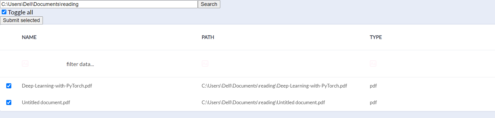
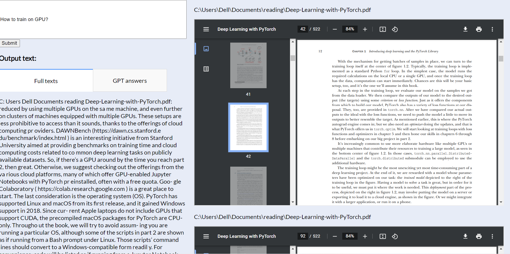

#  localindex

A search engine for local pdf files with a UI 

## installation
You can create a virtual (eg. conda) environment and install the requirements.
eg. from the command line
```
conda create -n indexapp python=3.7.10
conda activate indexapp
pip install -r requirements.txt
```

## startup
We'll use the command line.\
After activating the indexapp environment you can start the flask API backend from the root directory with:
```
python start_backend.py
```
The frontend should be started from a separate commend prompt. If you want to use the GPT answers for your query please specify the OPENAI_API_KEY env variable.\
To startup activate the indexapp env and run the script:
```
python start_frontend.py
```
The UI is then available at http://localhost:5000

## usage
At http://localhost:5000 you'll find the following landing page


The "Files select" is an application to search local directories for pdf files and select those that you want indexed.

Here enter a root directory to search for pdf files. Then select files to index. Press "Submit selected" to index those files.

The "Search app" is basically a small search engine to find text pieces matching a query.

Enter the query on the upper left side and press submit. The pdf files will open up to the files and pages where the matching information can be found. Under the "Full texts" tab the raw texts are mentioned. If you have OpenAI credits you can see a GPT answer under the "GPT answers" tab. This uses the raw texts as context to answer the query.

## Buildup
The application is built using a combination of the Flask and Dash python frameworks. The overall structure is based on the very useful repository [Plotly Dash Flask Tutorial](https://github.com/toddbirchard/plotlydash-flask-tutorial?ref=hackersandslackers.com#plotly-dash-flask-tutorial). The combination of Flask and Dash provides endless flexibility of flask and leverages the quick UI assembly of dash.

The entry point for the flask+html+dash frontend is at start_frontend.py

On the backend the [huggingface transformers](https://github.com/huggingface/transformers) library is used for providing a semantic search algorithm. The used model is specified under settings.py model_ckpt. Currently the ["sentence-transformers/multi-qa-mpnet-base-dot-v1"](https://huggingface.co/sentence-transformers/multi-qa-mpnet-base-dot-v1) is specified. The functionality of this backend is put in a flask api. The entrypoint here is at start_backend.py.

## Vision
Noticed that I was spending a lot of time searching for the right documents and information contained in a quite convoluted folder structure. I hope this alleviates the pain in the future.

## Development and contribution
If you have good further ideas, suggestions, recommendations, contributions or you want to open a pull request feel free! Happy to hear feedback.

